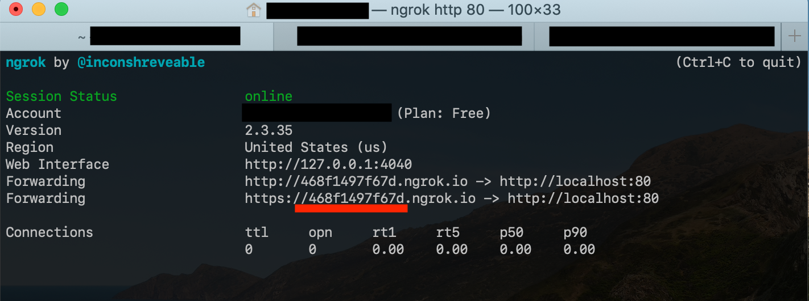
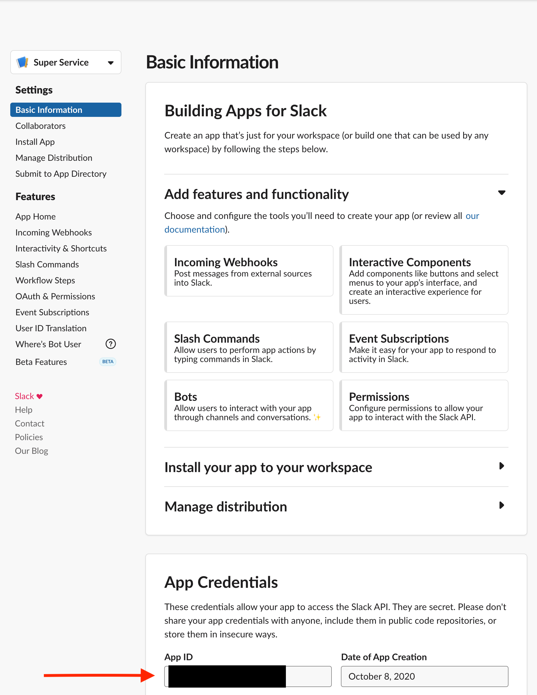
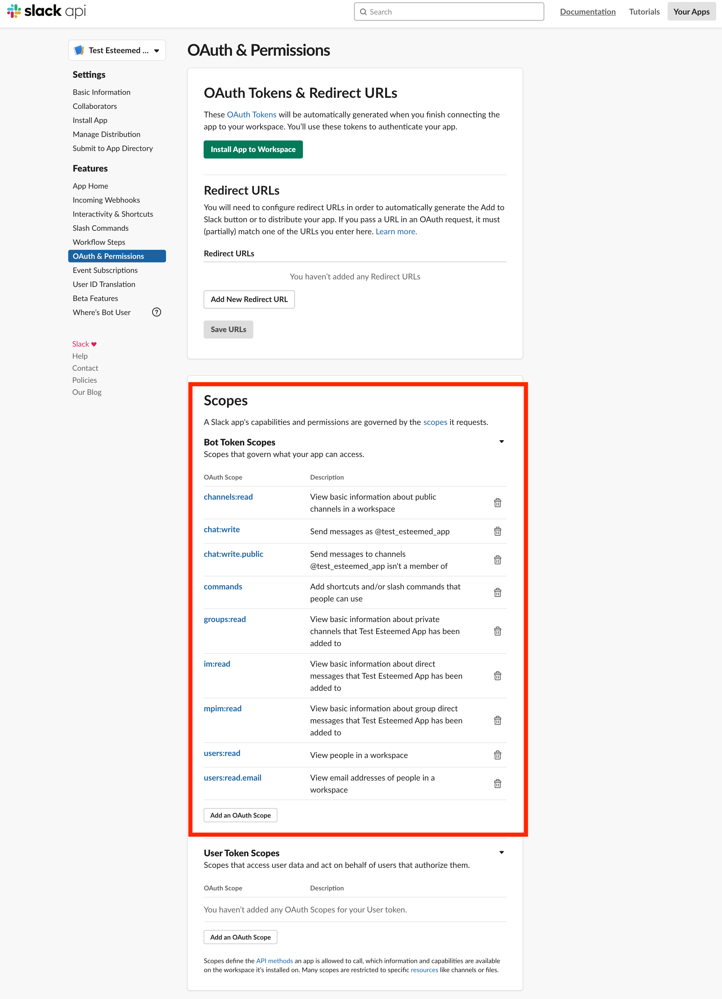
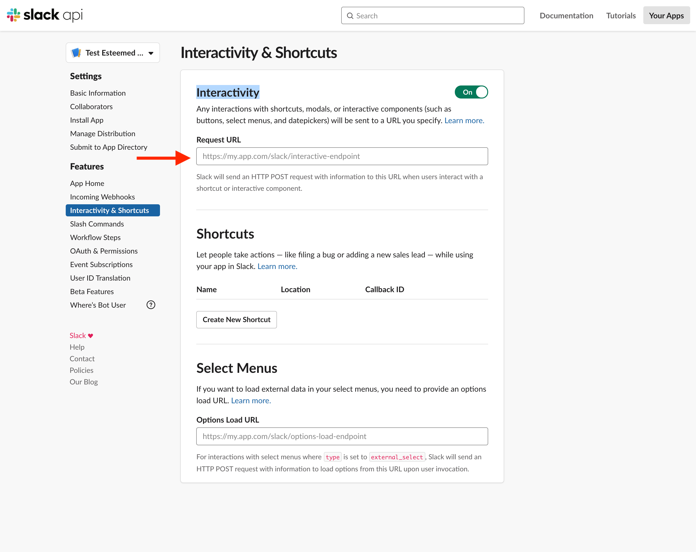
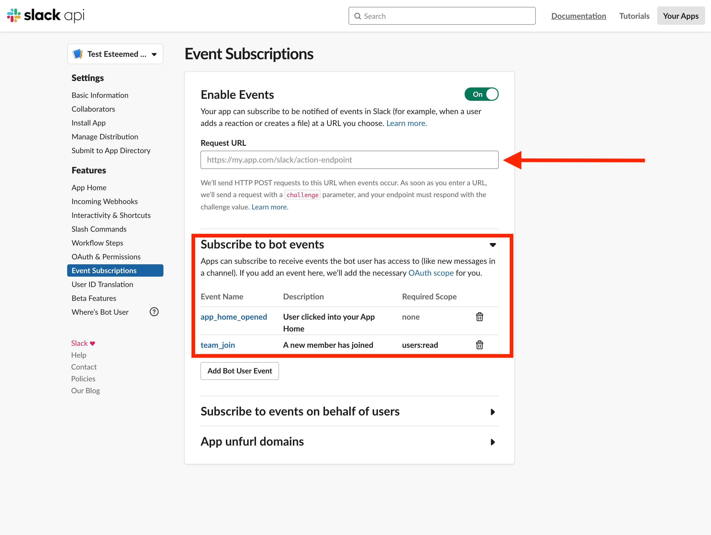

# Esteemed API

This repository provides the API layer for Esteemed's services. To begin local
development, please follow these steps.

## Clone the Repository and install node dependencies
1. Fire up a command prompt of choice.  Navigate to the folder you wish to clone the repository.
2. Run the following command

    `
      git clone https://github.com/EsteemedIO/esteemed-api.git
    `
3. Install node dependencies. From the source code root directory run the following command.

  `
    npm install
  `
4. Copy example.secrets.yml and populate with your own test API values.

## Setup Ngrok
1. Open a browser to [https://ngrok.com/](https://ngrok.com/)
2. Sign up for an account.
3. Install Ngrok by following the instructions.

  Note: It might be beneficial to install Ngrok default path. I would suggest the following commands

  ```
    sudo mv ngrok /usr/local/bin
    sudo chmod 755 /usr/local/bin/ngrok
  ```

4. Start ngrok.  From the root source directory run the following command.

    `
      sls tunnel
    `
5.  Take note of the url pattern for the ngrok tunnels.  We will refer to them as **$ngrok-url-prefix**.



## Setup Slack Workspace
1. Open a browser and navigate to the following link to create your own [Slack Workspace](https://slack.com/get-started#/create)
2. Follow the wizard and be sure the note the name used for the slack workspace

## Setup Slack Sandbox application
1. Open a browser and navigate to the [Slack API Website](https://api.slack.com/apps?new_app=1)
2. Click the Create App Button in the upper right hand corner and follow the wizard for new application template
3. Once the wizard is complete please take note of the App Id.  We will refer to them as the **$slack-app-id**



4. Under the Oath & Permissions Section https://api.slack.com/apps/**$slack-app-id**/oauth?
Add the following Permissions to the Bot Token Scope
  - channels:read
  - chat:write
  - chat:write.public
  - commands
  - groups:read
  - im:read
  - mpim:read
  - users:read
  - users:read.email
The permissions should look similar the image below.



5. Under the Interactivity & Shortcuts Section https://api.slack.com/apps/**$slack-app-id**/interactive-messages?
Turn the radio button on in the upper right hand corner by clicking on it.
6. Add the url https://**$ngrok-url-prefix**.ngrok.io/dev/slack/events to the text box labeled Request Url as depicted in the picture below



7. Under the Event Subscriptions https://api.slack.com/apps/**$slack-app-id**/event-subscriptions?
Turn the radio button on in the upper right hand corner by clicking on it.
8. Add the url https://**$ngrok-url-prefix**.ngrok.io/dev/slack/events to the text box labeled Request Url under the Enable Events subsection as depicted in the picture below
9. Under the Events Subscriptions section scroll down to the Subscribe to bot events subsection.
Add the permission app_home_opened and team_join as depicted in the picture below



## Setup [AWS](https://aws.amazon.com/)
TODO:  Need to write more detailed instructions
  - Setup parameters by going to Systems Manager > Parameter Store (all should be of type SecureString)
    - /prod/allowedChannels (comma delimited list of Slack channel IDs)
    - /prod/googleMaps (Google Map API key)
    - /prod/slackSigning (Slack Signing secret)
    - /prod/slackTokenBot (Slack Bot token)

## Commands to Run development instance of the Esteemed API
- Run `npm run develop` to create a local API server
- Run `sls tunnel` to create ngrok public tunnel on localhost.
- Run `npm run deploy` to deploy your API to AWS.

